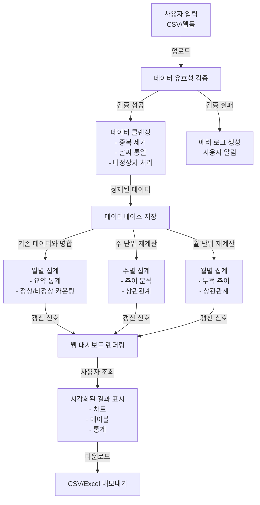

# PRD: 개인 데이터 정리 자동화 웹애플리케이션

**작성일**: 2026년 6월 20일  
**버전**: 1.0 (MVP 계획)  
**목표 완성일**: 4주 내 MVP 완성

---

## 1. 개요 및 목적

이 프로젝트는 **개인의 일상적인 데이터 정리 작업을 자동화하고, AI를 활용하여 그 결과를 시각화하는 웹 기반 애플리케이션**을 개발하는 것을 목표로 합니다.

**주요 목적:**
- 반복적인 데이터 수작업 정리 시간 대폭 단축
- 자동화된 데이터 정리·클렌징·분류를 통한 정확성 향상
- 일별/주별/월별 통계 대시보드로 직관적인 데이터 파악
- 향후 개인 재정 관리(가계부, 세금, 보험, 카드 혜택 등)로 확장 가능한 기반 구축

---

## 2. 문제 정의

### 현재 상황
- **수작업 부담**: 매달 정형화된 양식의 데이터를 수동으로 정리·취합·분류하고 있음
- **시간 낭비**: 데이터 분석보다 데이터 정리에 더 많은 시간이 소비됨
- **오류 위험**: 수작업 정리 과정에서 실수 및 누락 위험 증가
- **확장성 부족**: 현재는 개인의 일별 정리만 가능하며, 통계 분석이나 장기 추세 파악이 어려움
- **접근성 제약**: 로컬 PC의 메모장/엑셀에만 저장되어 있어 다른 기기에서 접근 불가

### 비전
개인의 모든 데이터(소비 기록, 건강 정보, 재정 현황 등)를 한곳에서 자동으로 정리·분석·시각화하고, 웹으로 언제든지 확인할 수 있는 통합 플랫폼 구축

---

## 3. 목표 및 성공 지표

### 1차 MVP 목표
- ✅ 데이터 자동 수집 및 정리 기능 완성
- ✅ 일별/주별/월별 자동 집계 및 시각화
- ✅ 웹 기반 대시보드 최소 버전 (간단한 차트/테이블)

### 성공 지표
| 지표 | 목표값 |
|------|--------|
| 데이터 정리 소요 시간 단축 | 월 15시간 → 월 2시간 (86% 단축) |
| 데이터 오류율 감소 | 수작업 3~5% → 자동화 <0.5% |
| 대시보드 로딩 시간 | <3초 |
| 시스템 안정성 (가용성) | 99% 이상 |

---

## 4. 사용자 및 이해관계자

### 주요 사용자
- **30대 직장인 싱글남** (본인)
  - 역할: 시스템의 유일한 사용자이자 데이터 수집자
  - 필요성: 시간 절약, 통합된 데이터 뷰
  - 기술 수준: 중상 (웹 기초 이해, 수작업 정리 경험)

### 향후 확장 대상 사용자 (Post-MVP)
- 개인 재정 관리 앱 사용자
- 자산(부동산, 주식, 보험) 통합 추적 필요자

---

## 5. 사용자 여정 (User Journey)

### 1차 데이터 업로드 및 초기화
```
1. 사용자가 웹 대시보드에 접속
2. CSV/엑셀 파일 또는 수동 입력으로 데이터 등록
3. 시스템이 데이터 형식 검증 및 자동 클렌징
4. 데이터베이스에 저장 완료
5. 사용자에게 성공 알림
```

### 일상적인 데이터 정리 흐름
```
1. 매일 사용자가 새로운 데이터 기입 (웹 폼 또는 CSV 업로드)
2. 시스템이 자동으로 데이터 유효성 검증
3. 기존 데이터와 자동 병합
4. 비정상치(이상치) 자동 감지 및 플래그 처리 또는 필터링
5. 일별/주별/월별 집계 자동 수행
6. 대시보드 자동 갱신
7. 사용자가 웹 대시보드에서 시각화된 결과 확인
```

### 대시보드 확인 프로세스
```
1. 사용자가 웹 대시보드 방문
2. 로그인 (확인 필요: 로그인 필요한가? 개인 사용이라 불필요할 수도)
3. 대시보드 홈: 최근 7일 요약 통계 확인
4. 상세 분석: "일별", "주별", "월별" 탭으로 상세 데이터 조회
5. 내보내기: 필요 시 데이터를 Excel/CSV로 다운로드
```

### 에러 처리 흐름
```
1. 데이터 형식 오류 (예: 날짜 형식 불일치)
   → 사용자에게 오류 메시지 표시 + 어떤 부분이 잘못됐는지 명확히 표시
   → 에러 로그 파일 자동 생성 (/logs/error_YYYYMMDD.log)
   
2. 값 누락 또는 비정상치
   → 비정상 데이터 행을 별도 플래그 처리 (확인 필요: 집계 제외? 플래그 표시?)
   → 대시보드에 "⚠️ 검증 경고" 배너 표시
   
3. 시스템 에러
   → 사용자 메일로 에러 알림 (향후)
   → 관리자 대시보드에 로그 기록
```

---

## 6. 기능 요구사항

### 6.1 데이터 입력 (Data Ingestion)
- [ ] **CSV/엑셀 파일 업로드 기능**
  - 지원 형식: CSV, XLSX (✅ MVP: CSV만 먼저)
  - 파일 크기 제한: 50MB 이하 (확인 필요)
  - 자동 검증: 필수 컬럼 확인, 데이터 타입 검증
  
- [ ] **웹 폼을 통한 수동 입력**
  - 폼 필드: [날짜], [데이터1], [데이터2], [데이터3], [메모(선택)]
  - 실시간 유효성 검사 (프론트엔드)
  - 엔터키로 빠른 제출 지원
  
- [ ] **데이터 컬럼 매핑 설정**
  - 관리자 설정 페이지에서 CSV 헤더와 시스템 컬럼 자동 매핑
  - 매핑 규칙을 JSON 설정 파일로 저장 (변경 용이)
  - 예: `{"csv_header": "속도", "system_column": "data1", "type": "float"}`

### 6.2 데이터 정리 및 클렌징 (Data Cleaning)
- [ ] **중복 제거**
  - 동일한 날짜+데이터1+데이터2의 조합 감지
  - 중복 시 최신 레코드만 유지
  
- [ ] **날짜 형식 통일**
  - 다양한 입력 형식(YYYY-MM-DD, DD/MM/YYYY 등) → 표준 YYYY-MM-DD로 변환
  - 올바른 범위의 날짜만 허용
  
- [ ] **비정상치(이상치) 처리**
  - **초반 구간 필터링**: 매일 오전 6시 이전 데이터는 품질 미측정으로 간주
    - 옵션 A: 집계에서 완전 제외
    - 옵션 B: 플래그 처리하되 별도 탭에서 확인 가능 (추천: 투명성)
  - **범위 초과**: 데이터1/2/3가 설정된 min/max 범위를 벗어나면 플래그 처리
  - **null/빈값**: 필수 필드는 거부, 선택 필드는 기본값 또는 평균값 대체
  
- [ ] **데이터 타입 변환**
  - 숫자형 필드: 텍스트 → 숫자로 변환, 실패 시 플래그
  - 날짜형 필드: 다양한 형식 → 통일된 날짜 형식

### 6.3 데이터 집계 (Data Aggregation)
#### 일별 집계 (Daily)
- [ ] **일간 요약 통계** (정상 구간만)
  - 데이터1: 평균, 최소, 최대, 합계
  - 데이터2: 평균, 최소, 최대, 합계
  - 데이터3: 평균, 최소, 최대, 합계
  - 정상 데이터 개수 vs 비정상 데이터 개수 카운팅

#### 주별 집계 (Weekly)
- [ ] **최근 7일 추이**
  - 일별 평균 변화 추적
  - 요일별 패턴 분석 (예: 월요일 vs 금요일)
  
- [ ] **전주 대비 증감**
  - 이전 7일과의 비교
  - 증감율(%) 계산
  
- [ ] **상관관계 분석**
  - 데이터1-2, 데이터1-3, 데이터2-3 간 상관계수(Pearson) 계산
  - 산점도/히트맵으로 시각화

#### 월별 집계 (Monthly)
- [ ] **월간 누적 추이**
  - 월별 총합, 평균, 최고/최저값
  - 월 대비 증감율
  
- [ ] **일별 평균/합계 추이**
  - 월 내 날짜별 변화 그래프
  
- [ ] **상관관계 분석**
  - 주별 집계와 동일 방식

### 6.4 대시보드 및 시각화 (Dashboard & Visualization)
- [ ] **웹 대시보드 홈화면**
  - 최근 7일 요약 카드 (평균, 최대, 최소, 데이터 개수)
  - 최근 30일 추이 차트 (라인 그래프)
  - 필터: 날짜 범위 선택 가능
  
- [ ] **일별 상세 분석 탭**
  - 테이블: 날짜, 데이터1, 데이터2, 데이터3, 정상 여부
  - 차트: 일자별 막대그래프
  - 필터: 정상/비정상 구분 표시
  
- [ ] **주별 분석 탭**
  - 라인 그래프: 7일 추이
  - 매트릭: 전주 대비 증감율
  - 히트맵: 데이터1-2-3 간 상관계수
  
- [ ] **월별 분석 탭**
  - 라인 그래프: 월별 누적 추이 (지난 6개월)
  - 막대 그래프: 월간 비교
  - 산점도: 상관관계 시각화
  
- [ ] **데이터 다운로드**
  - 현재 뷰(필터 적용된 데이터)를 CSV/Excel로 내보내기
  - 고정 포맷 제공

### 6.5 시스템 관리 및 설정
- [ ] **관리자 페이지** (확인 필요: 본인 전용인가?)
  - 컬럼 매핑 설정: CSV 헤더 ↔ 시스템 컬럼 매핑
  - 비정상치 범위 설정: 각 데이터1/2/3의 min/max 임계값
  - 초반 구간 설정: 필터링 시작 시간 (기본값: 오전 6시)
  - 데이터베이스 유지보수: 백업, 복원, 기간별 데이터 삭제
  
- [ ] **로그 및 모니터링**
  - 업로드 이력: 파일명, 업로드 시간, 처리 결과, 행 수, 오류 수
  - 시스템 로그: 에러 로그, 경고 로그

---

## 7. 비기능 요구사항

| 항목 | 요구사항 | 이유 |
|------|---------|------|
| **성능** | 대시보드 로딩 <3초, 데이터 처리 <10초 | 사용자 경험 (개인 사용) |
| **안정성** | 시스템 가용성 99% 이상 | 일일 사용 보장 |
| **확장성** | 월 1천만 행 데이터까지 처리 가능 구조 | 장기 서비스 확장 대비 |
| **보안** | 로컬 저장소 암호화 (향후), HTTPS 통신 | 개인 재정 정보 보호 |
| **원본 보존** | 원본 CSV/업로드 파일 별도 저장 | 데이터 복구, 감사 추적 |
| **데이터 정합성** | 정리 과정에서 원본 데이터 불변 | 추적 가능성 |
| **운영성** | 로그 자동 로테이션 (30일 단위) | 디스크 공간 관리 |
| **복구성** | 일일 자동 백업 (7일 보관) | 장애 대응 |

---

## 8. 데이터 흐름도



---

## 9. 기술 스택 제안 및 선정

### 후보 기술 스택 비교

| 항목 | **Option 1: FastAPI + Vue.js** | **Option 2: Django + React** | **Option 3: Streamlit (추천)** |
|------|------|------|------|
| **난이도** | 중 | 중상 | 하 (빠른 프로토타입) |
| **학습곡선** | 가파름 (FastAPI 신규) | 중간 (Django 숙련 필요) | 완만 (Python 중심) |
| **유지보수성** | 좋음 (명확한 구조) | 매우 좋음 | 우수 (Python 코드만) |
| **배포 용이성** | 중 (별도 서버) | 중 (별도 서버) | 매우 높음 (로컬 실행) |
| **대시보드 구성** | 수작업 많음 | 수작업 많음 | 자동 생성 (빠름) |
| **상관관계/시각화** | Plotly + pandas | Plotly + Django ORM | Altair/Plotly 통합 |
| **데이터 처리** | pandas | pandas | pandas |
| **데이터베이스** | PostgreSQL 또는 SQLite | PostgreSQL 또는 MySQL | SQLite |
| **확장성** | 우수 (API 기반) | 우수 (서비스 분리 가능) | 제한적 (단일 앱) |
| **MVP 완성 시간** | 2~3주 | 3주 | **1~2주** |

### 🎯 **최종 선정: Streamlit 기반** (MVP 단계)

**선정 근거:**
1. **빠른 개발**: 4주 내 MVP 완성이 목표 → Streamlit으로 1~2주 내 완성 가능
2. **Python 중심**: 데이터 정리/분석은 pandas + scipy로 충분, 별도 프론트엔드 언어 불필요
3. **시각화 통합**: Streamlit이 차트/그래프 기본 지원, Plotly 연동 용이
4. **개인 용도 최적**: 로컬/개인 서버에서 실행하기 적합
5. **이후 마이그레이션 용이**: MVP 완성 후 필요시 FastAPI로 리팩토링 가능

### 상세 기술 스택 (최종)

```
Frontend:
  - Streamlit (웹 UI 자동 생성)
  - Plotly (시각화: 차트, 산점도, 히트맵)
  - pandas (데이터 조작)

Backend:
  - Python 3.9+
  - pandas (데이터 처리, 집계)
  - scipy (상관관계 분석)
  - openpyxl (Excel 내보내기, 향후)

Database:
  - SQLite (로컬 저장, 개인 용도 충분)
  - 또는 PostgreSQL (확장성 고려 시)

Deployment (MVP):
  - Windows 로컬 PC (Python 스크립트 실행)
  - 향후: Streamlit Cloud 또는 자체 서버

주요 라이브러리:
  - streamlit: ^1.28
  - pandas: ^2.0
  - scipy: ^1.11
  - numpy: ^1.24
  - plotly: ^5.17
  - openpyxl: ^3.1 (향후)
  - python-dotenv: ^1.0 (환경변수)
  - sqlalchemy: ^2.0 (DB ORM)
```

---

## 10. 폴더/파일 구조 제안

```
data-automation-webapp/
├── README.md
├── requirements.txt
├── .env.example
├── .gitignore
│
├── config/
│   ├── __init__.py
│   ├── settings.py              # 애플리케이션 설정 (DB, 로그, 임계값)
│   ├── column_mapping.json      # CSV 컬럼 매핑 설정
│   └── thresholds.json          # 비정상치 범위 설정
│
├── data/
│   ├── raw/                     # 원본 CSV 저장소
│   ├── processed/               # 정제된 데이터 저장소
│   ├── backups/                 # 일일 백업 저장소
│   └── logs/                    # 에러/처리 로그
│
├── database/
│   ├── __init__.py
│   ├── models.py                # SQLAlchemy 모델 (테이블 정의)
│   ├── connection.py            # DB 연결 설정
│   └── migrations/              # 스키마 마이그레이션 (향후)
│
├── processors/
│   ├── __init__.py
│   ├── cleaner.py               # 데이터 클렌징 로직
│   ├── aggregator.py            # 일별/주별/월별 집계 로직
│   ├── validator.py             # 유효성 검증 로직
│   └── correlation.py           # 상관관계 분석 로직
│
├── services/
│   ├── __init__.py
│   ├── upload_service.py        # 파일 업로드 처리
│   ├── data_service.py          # DB 조회/저장 로직
│   └── report_service.py        # 리포트/대시보드 데이터 조회
│
├── ui/
│   ├── __init__.py
│   ├── app.py                   # Streamlit 메인 앱
│   ├── pages/
│   │   ├── 1_🏠_홈.py          # 홈 대시보드
│   │   ├── 2_📊_일별분석.py    # 일별 상세 분석
│   │   ├── 3_📈_주별분석.py    # 주별 분석
│   │   ├── 4_📅_월별분석.py    # 월별 분석
│   │   ├── 5_⚙️_설정.py        # 관리자 설정
│   │   └── 6_📥_업로드.py      # 데이터 업로드
│   └── components/
│       ├── charts.py            # 차트 생성 함수
│       ├── tables.py            # 테이블 렌더링 함수
│       └── widgets.py           # 공통 위젯
│
├── scripts/
│   ├── __init__.py
│   ├── run_daily_processing.py  # 일일 자동 처리 스크립트
│   ├── run_weekly_aggregation.py
│   ├── run_monthly_aggregation.py
│   ├── backup.py                # 백업 스크립트
│   └── init_db.py               # 초기 DB 생성
│
└── tests/
    ├── __init__.py
    ├── test_cleaner.py
    ├── test_aggregator.py
    ├── test_validator.py
    └── test_upload.py
```

---

## 11. 단계별 개발 마일스톤 (4주 MVP 계획)

### 📅 **1주차: 기초 인프라 구축**

**목표**: 프로젝트 구조 및 DB 초기화 완성

- [ ] 프로젝트 폴더 구조 생성 및 Git 초기화
- [ ] 요구 라이브러리 설치 및 requirements.txt 작성
- [ ] SQLite DB 스키마 설계 및 생성 (테이블: raw_data, daily_agg, weekly_agg, monthly_agg, audit_log)
- [ ] 환경변수 설정 (.env)
- [ ] 설정 파일 작성 (column_mapping.json, thresholds.json)
- [ ] README.md 작성 (프로젝트 설명 및 실행 방법)

**산출물**: 
- DB 초기화 스크립트
- 설정 파일 템플릿
- 프로젝트 구조 완성

---

### 📅 **2주차: 데이터 처리 파이프라인**

**목표**: 데이터 수집 → 정제 → 기본 집계 완성

- [ ] CSV 파일 업로드 모듈 개발 (파일 유효성 검증)
- [ ] 데이터 클렌징 로직 구현
  - 중복 제거
  - 날짜 형식 통일
  - 비정상치 감지 및 플래그 처리
- [ ] 일별 집계 로직 구현 (평균, 최소, 최대, 합계)
- [ ] 일별 데이터 DB 저장
- [ ] 웹 폼 입력 기능 (Streamlit 폼)
- [ ] 에러 로깅 시스템 구축

**산출물**:
- cleaner.py, validator.py, upload_service.py
- 테스트 데이터 및 단위 테스트
- 에러 로그 샘플

---

### 📅 **3주차: 대시보드 및 시각화**

**목표**: 웹 대시보드 기본 버전 완성

- [ ] Streamlit 메인 앱 구조 설계
- [ ] 홈 대시보드 구현 (최근 7일 요약 + 차트)
- [ ] 일별 분석 페이지 (테이블 + 차트)
- [ ] 주별 집계 로직 구현 (7일 추이, 상관관계)
- [ ] 주별 분석 페이지 (라인 그래프 + 히트맵)
- [ ] Plotly를 활용한 시각화 컴포넌트 개발
- [ ] 데이터 다운로드 기능 (CSV 내보내기)

**산출물**:
- app.py (메인 Streamlit 앱)
- pages/ 디렉토리 (각 분석 페이지)
- charts.py, components.py (시각화 함수)
- 샘플 대시보드 스크린샷

---

### 📅 **4주차: 월별 집계 & 최적화 & 배포 준비**

**목표**: MVP 완성 및 배포 준비

- [ ] 월별 집계 로직 구현 (월간 누적, 상관관계)
- [ ] 월별 분석 페이지 완성
- [ ] 상관관계 분석 구현 (상관계수 계산, 산점도)
- [ ] 관리자 설정 페이지 구현 (컬럼 매핑, 임계값 설정)
- [ ] 성능 최적화 (데이터 캐싱, 쿼리 최적화)
- [ ] 자동 배포 스크립트 작성 (run_daily_processing.py)
- [ ] 통합 테스트 및 버그 수정
- [ ] 배포 매뉴얼 작성
- [ ] 최종 문서화 (API 문서, 사용자 가이드)

**산출물**:
- 완성된 MVPWebApp
- 배포 가이드
- 사용자 매뉴얼
- 시스템 아키텍처 문서

---

### 📊 **마일스톤 진행도**

```
Week 1: ████░░░░░░ (기초)
Week 2: ████████░░ (처리)
Week 3: ████████████░░ (대시보드)
Week 4: ██████████████ (최적화 + 배포준비)

MVP 완성 목표: 4주차 금요일
```

---

### ⏭️ **Post-MVP 고도화 계획** (향후)

다음 단계에서 추진할 사항 (4주 이후):

1. **웹 배포**
   - Streamlit Cloud 또는 자체 서버(AWS/GCP) 배포
   - Docker 컨테이너화
   - HTTPS/인증 추가

2. **자동화 고도화**
   - 스케줄러 (APScheduler) 통합 → 일일 자동 집계
   - 알림 기능 (이메일, Slack 등)
   
3. **데이터 확장**
   - 가계부 데이터 통합 (카드 거래 내역 자동 수집)
   - 세금/보험 정보 통합
   - 부동산, 주식 자산 데이터 연동
   
4. **고급 분석**
   - 머신러닝 기반 이상치 탐지
   - 미래 예측 (시계열 모델)
   - 카드 혜택/할인 자동 추천
   
5. **사용성 개선**
   - 모바일 반응형 디자인
   - 다국어 지원
   - 다크 모드

---

## 12. Out of Scope (이번 MVP 범위 밖)

### 1. ❌ 실시간 모니터링/알림 기능
- **사유**: 4주 일정 제약 + 개인 사용 우선 기능 아님
- **계획**: Post-MVP 3주차에 APScheduler + 이메일 알림 추가

### 2. ❌ 웹 기반 완전 배포 (클라우드/서버)
- **사유**: MVP는 로컬 PC 중심, 배포 인프라 구축에 시간 소모
- **현재**: Windows 로컬 Streamlit 실행 중심
- **계획**: Post-MVP 2주차에 Streamlit Cloud 배포 추진

### 3. ❌ 자동 이메일 발송/리포트 배포
- **사유**: 알림 기능 자체가 MVP 범위 밖
- **계획**: Post-MVP 단계에서 추가

### 4. ❌ 다른 부서·다른 데이터 소스 통합
- **사유**: 개인 단독 사용 우선, 확장성은 아키텍처에 반영
- **계획**: 고객 피드백 후 Post-MVP에서 검토

### 5. ❌ 원본 데이터 전체 백필(Backfill)
- **사유**: 현재 데이터가 없는 상태, 1차는 신규 발생분부터 누적
- **계획**: 데이터 보유 후 필요시 추가 구현

### 6. ❌ 모바일 환경 대응
- **사유**: Streamlit 웹은 모바일 미지원, 반응형 개발 시간 소모
- **계획**: Post-MVP에서 모바일 앱(Flutter/React Native) 검토

### 7. ❌ 고급 머신러닝 분석 (이상치 탐지, 예측 모델)
- **사유**: MVP는 기본 통계에 집중, ML 모델 학습 시간 불필요
- **계획**: Post-MVP 4주차 이후

### 8. ❌ 멀티유저 및 권한 관리
- **사유**: 개인 단독 사용이므로 불필요
- **계획**: 향후 팀 공유 필요 시 추가

### 9. ❌ 가계부/세금/보험 통합 (초기 아이디어)
- **사유**: 데이터 자동화가 MVP 핵심, 재정 통합은 별도 확장 프로젝트
- **계획**: MVP 완성 후 별도 페이즈 2 계획 수립

---

## 13. 리스크 및 제약사항

### 🚨 **기술적 리스크**

| 리스크 | 영향도 | 가능성 | 완화 방안 |
|--------|--------|--------|---------|
| **Streamlit 성능 제약** (대용량 데이터 시) | 중 | 중 | 데이터 페이지네이션, 캐싱 구현 |
| **SQLite 동시성 문제** | 중 | 낮 | 향후 PostgreSQL로 마이그레이션 |
| **CSV 형식 다양성** | 높 | 높 | 컬럼 매핑 설정으로 유연하게 대응 |
| **데이터 누락/중복** 미처리 | 중 | 중 | 검증 로직 강화, 감사 로그 유지 |

### 📋 **운영 제약**

| 항목 | 설명 | 대응 |
|------|------|------|
| **데이터 수집 주기** | 확인 필요: 매일? 주 1회? | 초기: 수동 업로드, 자동화는 Post-MVP |
| **비정상치 정의** | 초반 구간(오전 6시 전) 필터링 기준 확정 필요 | 설정 파일로 유연하게 변경 가능 |
| **컬럼 명명** | 현재 "데이터1/2/3" 임시명 사용 → 실제명 필요 | 최소 1주차 내 확정 필요 |
| **로컬 저장소 용량** | 월 1천만 행 기준 추정 용량 계산 필요 | 증분 저장소 계획 수립 |
| **Windows Task 스케줄러** | 자동 실행은 Windows Scheduler 또는 Streamlit Cloud 필요 | MVP는 수동 실행, Post-MVP에서 자동화 |

### 📋 **데이터 품질 제약**

| 항목 | 현황 | 해결 |
|------|------|------|
| **초반 구간 비정상치** | 오전 6시 전 데이터 품질 미측정 | 필터링 또는 플래그 처리 (설정 가능) |
| **데이터 형식 일관성** | 다양한 CSV 형식 예상 | 컬럼 매핑 설정으로 자동 변환 |
| **누락값/이상치** | 예상됨 | 기본값 대체 또는 행 제외 (설정 가능) |

### 💼 **비즈니스/조직 제약**

| 항목 | 제약 | 대응 |
|------|------|------|
| **프로젝트 기간** | 4주 MVP 완성 목표 | 우선순위 집중 (스코프 축소 가능) |
| **인력** | 1인 개발 | 코드 자동화 도구(Copilot, ChatGPT) 활용 |
| **의존성** | 외부 API 없음 (로컬 기반) | 배포 시에만 고려 필요 |

---

## 14. 확인 필요 항목 (Open Questions)

개발 착수 전 다음 항목들을 최종 확정해주세요:

- [ ] **데이터 컬럼명**: "데이터1/2/3" 대신 실제 컬럼명은? (예: 속도, 온도, 습도 등)
- [ ] **데이터 발생 주기**: 매일 1회? 시간은 정해졌나? (예: 자정, 오전 6시 등)
- [ ] **초반 구간 기준**: 오전 6시 고정인가, 유동적인가?
- [ ] **비정상치 처리 방식**: 필터링(집계 제외) vs 플래그(별도 표시)? 사용자 선호도?
- [ ] **원본 파일 형식**: 현재 CSV인가? 향후 변경 가능성?
- [ ] **데이터 보관 기간**: 몇 개월/년 단위로 보관할 것인가? (저장소 설계 영향)
- [ ] **접근성**: 본인만 사용인가, 향후 팀 공유 가능성은?
- [ ] **초기 데이터**: 기존 과거 데이터가 있나? (백필 필요 여부)
- [ ] **자동화 방식**: 초기는 수동 실행? 언제부터 자동화(스케줄러)?

---

## 15. 첨부 자료

### A. 개발 환경 요구사항

```
OS: Windows 10/11
Python: 3.9 이상
메모리: 4GB 이상
디스크: 50GB 이상 (데이터 저장소)

필수 라이브러리:
  - streamlit (웹 UI)
  - pandas (데이터 처리)
  - scipy (통계)
  - sqlalchemy (ORM)
  - plotly (시각화)
```

### B. 데이터 샘플 (예시)

**입력 CSV 형식:**
```
날짜,데이터1,데이터2,데이터3
2026-06-19,95.2,42,3.1
2026-06-19,98.1,45,2.9
2026-06-20,102.3,48,3.5
```

**DB 스키마 (raw_data 테이블):**
```
id (PK)
date
data1
data2
data3
is_valid (플래그)
uploaded_at
source_file
```

### C. 참고 자료

- 상관계수 계산: scipy.stats.pearsonr()
- 시각화: Plotly Express
- 데이터 조작: pandas groupby(), rolling() 등

---

## 📝 **최종 승인**

| 항목 | 상태 |
|------|------|
| **PRD 버전** | 1.0 |
| **작성 완료일** | 2026-06-20 |
| **검토 필요** | YES (위 "확인 필요 항목" 참고) |
| **개발 시작 예정** | 확인 후 1주차 시작 |
| **MVP 완성 목표** | 4주차 금요일 |

---

**작성자**: GitHub Copilot  
**마지막 업데이트**: 2026-06-20
